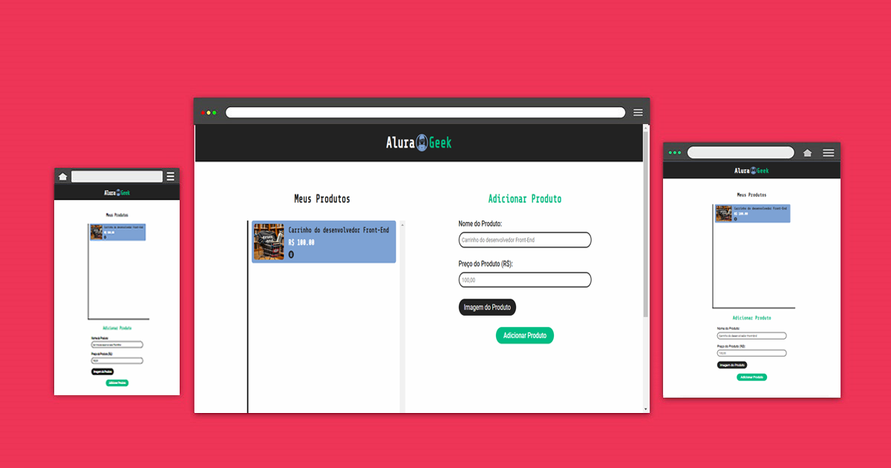

# 🚀 AluraGeek


## 📋 Índice
- [Descrição](#-descrição)
- [Demonstração](#-demonstração)
- [Tecnologias Utilizadas](#-tecnologias-utilizadas)
- [Pré-requisitos](#-pré-requisitos)
- [Como Executar o Projeto](#-como-executar-o-projeto)
- [Funcionalidades](#-funcionalidades)
- [Estrutura do Projeto](#-estrutura-do-projeto)
- [Contribuição](#-contribuição)
- [Licença](#-licença)
- [Contato](#-contato)

---

## 📝 Descrição
O **AluraGeek** é um projeto desenvolvido para praticar e aplicar conceitos de **HTML**, **CSS**, **JavaScript** e **Node.js**. O objetivo é criar uma aplicação que simula um e-commerce focado em produtos para desenvolvedores e entusiastas de tecnologia.

---

## 💻 Demonstração


---

## 🛠 Tecnologias Utilizadas
- **HTML5** e **CSS3**: Estrutura e estilização.
- **JavaScript** (ES6+): Lógica e funcionalidades do front-end.
- **Node.js**: Back-end e criação do servidor local.
- **JSON**: Simulação de banco de dados para produtos.
- **Fontes do Google**: Roboto e Share Tech Mono para uma tipografia moderna.
- **IA**: Auxílio com códigos e desenvolvimento.

---

## ⚙️ Pré-requisitos
Certifique-se de ter instalado as seguintes ferramentas:
- [Node.js](https://nodejs.org/)
- [Git](https://git-scm.com/)

Além disso, é recomendado ter um editor de código, como o **[VSCode](https://code.visualstudio.com/)**.

---

## 🚀 Como Executar o Projeto
1. **Clone este repositório:**
   ```bash
   git clone https://github.com/seu-usuario/alurageek.git
   ```
2. **Acesse a pasta do projeto:**
   ```bash
   cd alurageek
   ```
3. **Instale as dependências:**
   ```bash
   npm install
   ```
4. **Inicie o servidor:**
   ```bash
   node ./scripts/backend/server.js
   ```
5. **Abra o navegador e acesse:**
   ```
   http://localhost:3000
   ```

---

## ✨ Funcionalidades
- [x] Listagem de produtos com informações detalhadas.
- [x] Sistema de carrinho de compras.
- [x] Filtros e pesquisa de produtos.
- [x] Design responsivo para dispositivos móveis.
- [x] Banco de dados local em JSON para simular produtos.

---

## 📁 Estrutura do Projeto

```plaintext
alurageek
├── assets
│   ├── images
│   └── images_uploads
├── json
│   └── produtos.json
├── node_modules
├── scripts
│   ├── backend
│   │   └── server.js
│   └── frontend
│       └── main.js
├── styles
│   └── style.css
├── index.html
├── package.json
├── package-lock.json
└── README.md
```

---

## 🤝 Contribuição
Contribuições são **bem-vindas**! Sinta-se à vontade para abrir uma issue ou enviar um pull request.

---

## 📄 Licença
Este projeto está sob a licença **MIT**. Veja o arquivo [LICENSE](LICENSE) para mais detalhes.

---

## 📞 Contato
📧 **Matheus Pio Giannotti** - [matheuspiogiannotti@gmail.com](matheuspiogiannotti@gmail.com)

💼 [LinkedIn](https://www.linkedin.com) | 🐙 [GitHub](https://github.com)

---

### 🌟 Agradecimentos
Meus agradecimentos à **Alura** e aos seus instrutores pela inspiração para criar esse projeto!
Agradeço também à **Oracle** e todos aqueles que compõem o progama **ONE** pela oportunidade.
E um agradecimento especial ao **Instituto Conceição Moura** através do qual pude dar inicio a
todo este caminho.
